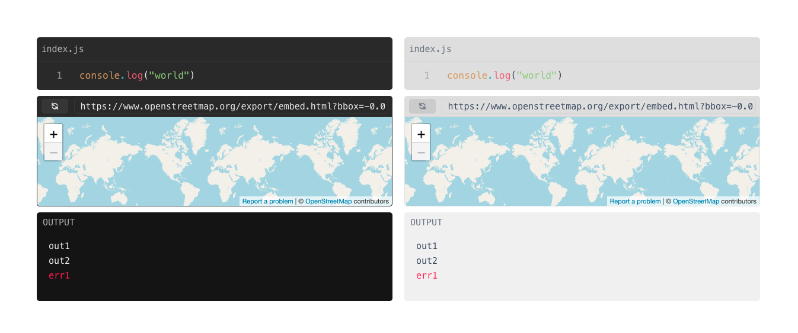

# Devbook UI
Devbook UI is a React UI library.

## Installation
```sh
npm install @devbookhq/ui
```

## Usage
Available components:
- [Editor](#editor)
- [Iframe](#iframe)
- [Output](#output)



### Editor
```tsx
import { Editor, Language } from '@devbookhq/ui'

export default function ExampleEditor() {
  return (
    <Editor
      filename="index.js"
      language={Language.js}
      initialContent='console.log("world")'
      onContentChange={(content) => console.log(content)}
      lightTheme={true}
    />
  )
}
```

Supported languages:
* JS/JSX
* TS/TSX
* Shell
* SQL

### Iframe
```tsx
import { Iframe } from '@devbookhq/ui'

export default function ExampleIframe() {
  return (
    <Iframe
      url="https://..."
      lightTheme={false}
      height={150}
    />
  )
}
```

### Output
```tsx
import { Outpout } from '@devbookhq/ui'

export default function ExampleOutput() {
  return (
    <Output
      stdout={['out1', 'out2']}
      stderr={['err1']}
      lightTheme={false}
      height={150}
    />
  )
}
```

## Example projects
* [React example](examples/react-app)
